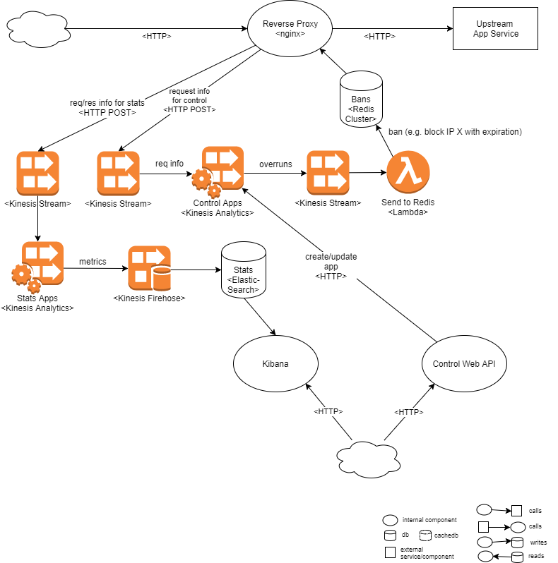

# ratelimiting-proxy

*WORK IN PROGRESS*

Rate limiting and stats solution for a high traffic website or service

## Why?

Existing rate limiting solutions for NGINX use local memory for counters. This is not ideal when you have high traffic and an [active-active nginx configuration](https://www.nginx.com/resources/admin-guide/nginx-ha-keepalived-nodes/).

## High-level architecture

*TO-DO*

Because of the high traffic, this solution uses background analytics to check the limits:

App server proxies --req info--> Streaming solution --overruns--> Shared storage --> App server proxies

So, your app server proxies must only check if current request should be rejected because of an overrun.

## AWS implementation

This repo includes an implementation using AWS Kinesis.

## Components

* [Web API for Control](control-admin/)
* Lua client for AWS Kinesis (send requests/response info)
* Lua client for Redis (check rate limit)
* AWS Kinesis Analytics app and Elasticsearch+Kibana for usage metrics